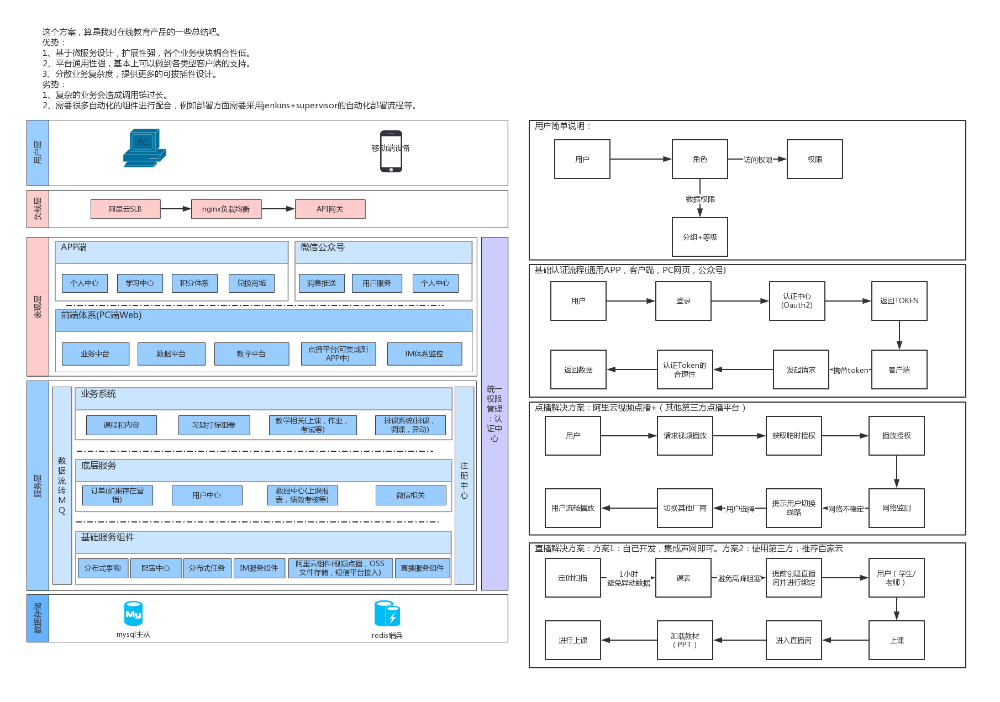

## 项目介绍
教育之星是基于微服务构建的在线教育管理产品。技术基础是基于Spring Cloud体系构建，使用的是最新的稳定2.1.12.RELEASE的Spring boot 版本  
Spring boot与Spring Cloud 版本对照请参考：[版本对照](https://start.spring.io/actuator/info)  

### 项目技术栈
#### 后端技术栈
1. Spring Cloud 系列
2. Spring Boot
3. Spring Security
4. Oauth2
5. nacos
6. seata
7. rabbitMq
8. redis
9. mysql
10. Mybatis
11. Websocket
12. Sharding-jdbc
13. openFeign  
14. ...  
#### 前端技术栈

1. Vue
2. ElementUI
3. axios
4. vue-router
5. Vuex
6. WebSocket
7. vue-cli4
8. ...

